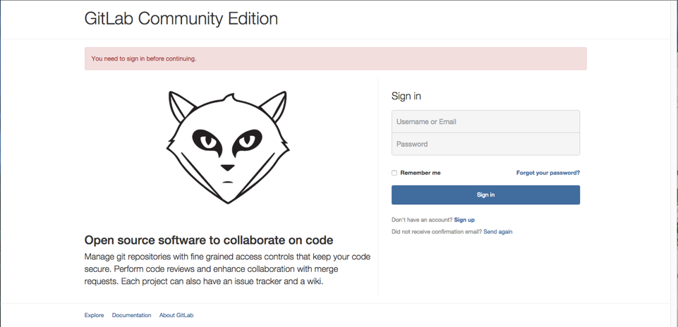
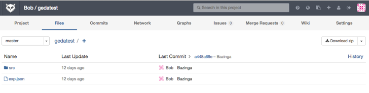
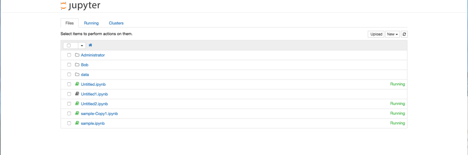

# Data Hub Manual
This is the manual for data hub system.
## Registration
After connecting to VPN, type <http://10.2.2.31> to open the main page of GitLab for registration.

## Make a New Project
Clike  to make a new project. 

You can find all your projects in GitLab.

## Enter into Data Hub IPython Notebook Web Server

After connecting to VPN, type <http://10.2.2.32:7777> to open the data hub IPython Notebook Web Server.

